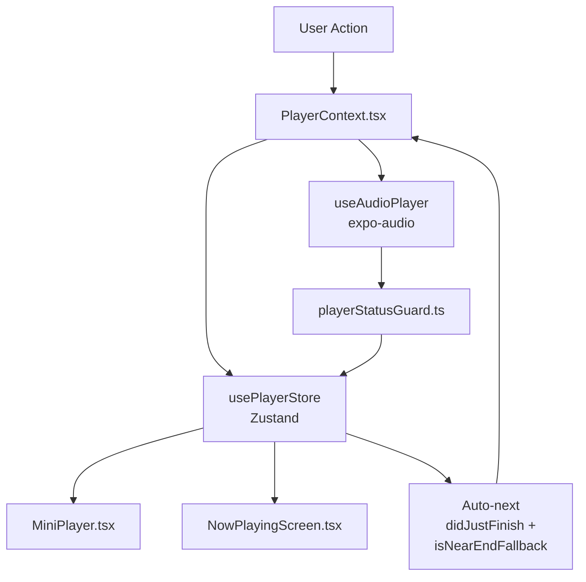
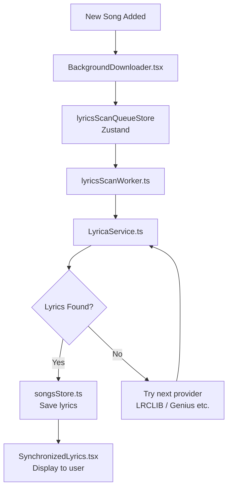
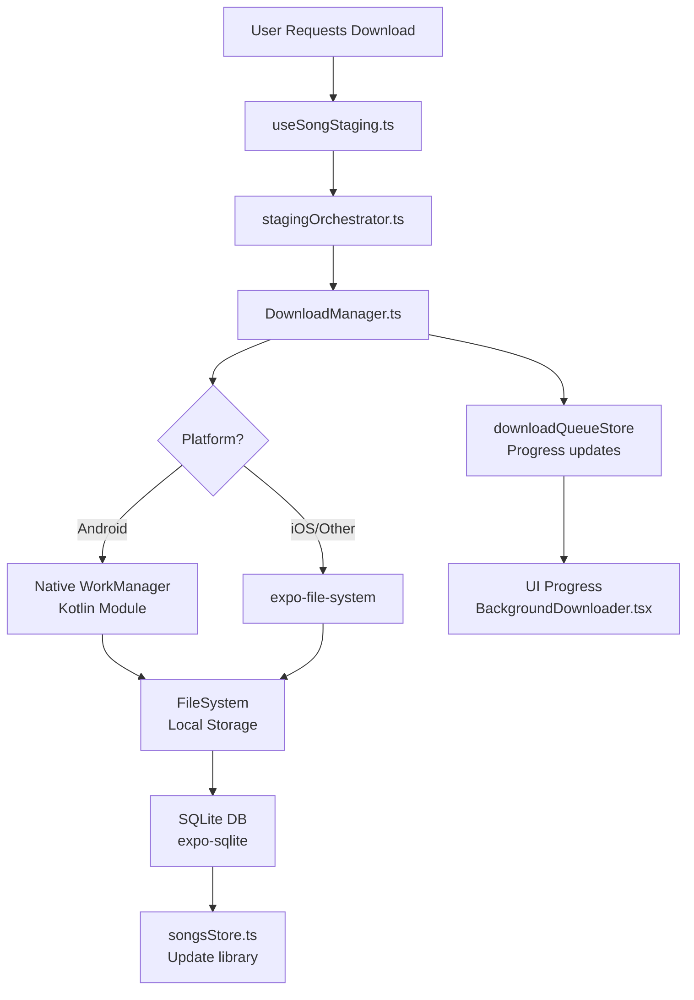
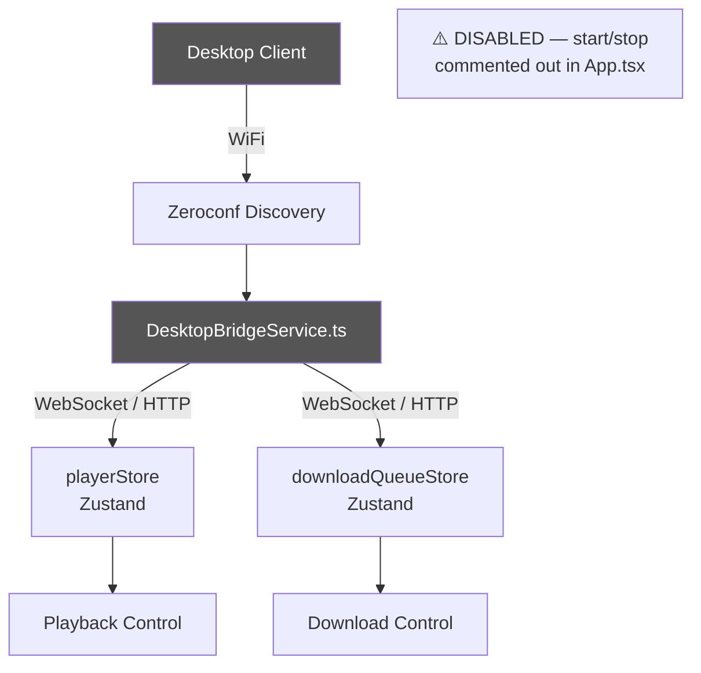

# LuvLyrics — Architecture Overview

This document provides a high-level overview of the four
core subsystems in LuvLyrics for new contributors.
Use this alongside `AGENTS.md` for a complete picture
of the codebase.

---

## 1. Playback Engine

### Summary
The playback engine is built around `PlayerContext.tsx`,
which wraps `expo-audio`'s `useAudioPlayer` hook and syncs
all playback status to Zustand via `usePlayerStore`.
`MiniPlayer.tsx` reads from the store and owns the expanded
player UI. `playerStatusGuard.ts` prevents UI flicker during
buffering and seek operations by preserving the playing state.

### Key Files

| File | Role |
|------|------|
| `src/contexts/PlayerContext.tsx` | Wraps useAudioPlayer, syncs status to Zustand, handles auto-next |
| `src/contexts/playerStatusGuard.ts` | Preserves playing state during buffering/seek |
| `src/store/playerStore.ts` | Single source of truth for isPlaying, currentSong, position, queue |
| `src/components/MiniPlayer.tsx` | Expanded player UI — Dynamic Island + Classic styles |
| `src/screens/NowPlayingScreen.tsx` | Full player screen with audio load guard |

### Data Flow



---

## 2. Lyrics Scan Pipeline

### Summary
When a song is added to the library, the lyrics scan
pipeline automatically searches for and downloads matching
lyrics. `BackgroundDownloader` triggers the scan,
`lyricsScanQueueStore` manages the queue, and
`lyricsScanWorker` processes each item by calling
`LyricaService` and related providers before saving
results to `songsStore`.

### Key Files

| File | Role |
|------|------|
| `src/components/BackgroundDownloader.tsx` | Triggers lyrics scan on new songs |
| `src/store/lyricsScanQueueStore.ts` | Manages scan queue state |
| `src/services/lyricsScanWorker.ts` | Processes queue items one by one |
| `src/services/LyricaService.ts` | Fetches lyrics from providers |
| `src/store/songsStore.ts` | Stores final lyrics results |

### Data Flow



---

## 3. Download Pipeline

### Summary
The download pipeline handles audio file acquisition
from staging through to local storage and database.
`useSongStaging` coordinates the staging flow via
`stagingOrchestrator`, which hands off to
`DownloadManager`. On Android, downloads are routed
through a native `WorkManager` Kotlin module so they
survive app backgrounding and device restarts.
Completed files are written to the filesystem and
indexed in SQLite.

### Key Files

| File | Role |
|------|------|
| `src/services/useSongStaging.ts` | Entry point — initiates staging flow |
| `src/services/stagingOrchestrator.ts` | Coordinates staging decisions |
| `src/services/DownloadManager.ts` | Manages download queue and execution |
| `android/modules/DownloaderModule` | Native WorkManager Kotlin module |
| `src/store/downloadQueueStore.ts` | Tracks download queue state |

### Data Flow



> **Note:** `MAX_CONCURRENT` downloads is set to 2.
> Do not increase without testing on low-end Android.

---

## 4. Desktop Bridge

### Summary
The Desktop Bridge allows remote control of LuvLyrics
over WiFi using WebSocket, HTTP, and Zeroconf discovery.
`DesktopBridgeService` connects the desktop client to
`playerStore` and `downloadQueueStore` for playback
and download control.

> ⚠️ **Currently Disabled:** The Desktop Bridge is
> intentionally inactive. The `start()` and `stop()`
> calls in `App.tsx` are fully commented out.
> Do not re-enable without also enabling the full
> `stop()` cleanup in `DesktopBridgeService`.

### Key Files

| File | Role |
|------|------|
| `src/services/DesktopBridgeService.ts` | Bridge service — currently disabled |
| `src/store/playerStore.ts` | Player state exposed to bridge |
| `src/store/downloadQueueStore.ts` | Download state exposed to bridge |

### Data Flow



---

## Quick Reference

```
Playback:  PlayerContext → playerStore → MiniPlayer
Lyrics:    BackgroundDownloader → lyricsScanQueueStore → lyricsScanWorker → songsStore  
Downloads: useSongStaging → stagingOrchestrator → DownloadManager → WorkManager → SQLite
Bridge:    DesktopBridgeService → playerStore + downloadQueueStore (DISABLED)
```

---

*For contributor workflow, branch naming, and CI
commands see [AGENTS.md](../AGENTS.md) and
[CONTRIBUTING.md](../CONTRIBUTING.md).*